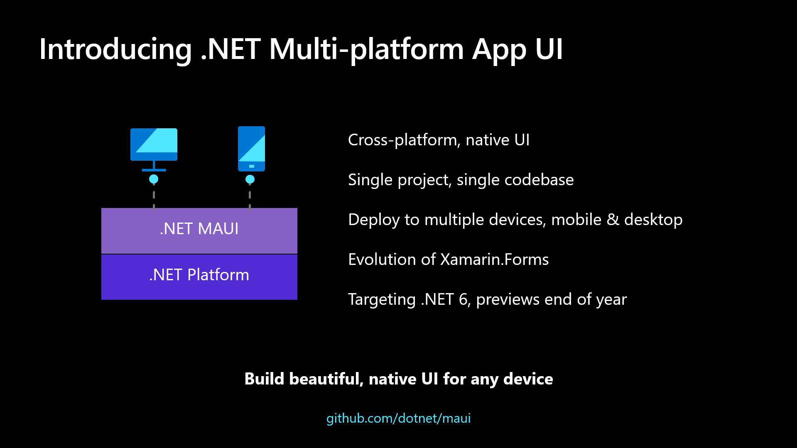

I started as a XAML/C#.NET developer for Windows apps, ranging from Windows Phone 7 and 10, and currently for Windows 10/11. But with the death of Microsoft's promise of unified development (UWP) - no more mobile platform, I thought of shifting to learn Xamarin to cover cross-platform development.

Albeit the countless Xamarin developers and community for help, I faced a lot of issues everytime the framework is updated which made my workflow a hassle. And I believed that UI widgets are far basic yet complicated to control.

## Flutter

So more than 2 years now, I had to develop mobile apps using Flutter/Dart and I enjoyed the adjustments I have to make were to familiarize with Dart language and Flutter's UI framework. It was also a challenge to do UI with full-code base compared to XAML designer but I felt Flutter development was quicker and more supported with various packages.

## Microsoft's Own Cross-platform UI Framework

.NET MAUI (Multi-platform App UI) allows building apps that targets mobile, tablet, web? and desktop using C#.NET and XAML. It is progressing impressively fast with their latest Preview 14 with the help of amazing contributors in the public repo.

Though I have a short time with Xamarin.Forms,

I have an open-mind to return to my beloved C#.NET and XAML to
